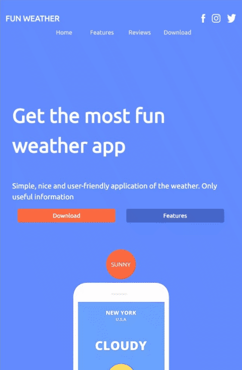
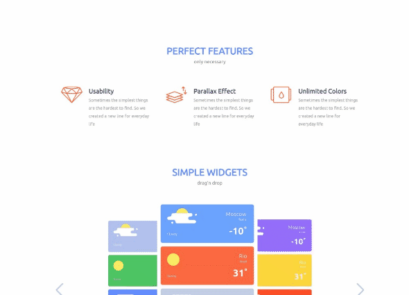

# Weather App - landing page

**This was my first real web dev. project**, implementing a website's landing page using **only HTML5 and CSS** *(no JavaScript)*. 
It is based on the design👨‍🎨 seen [here.](https://github.com/AsserElfeki/Weather-App/blob/master/src/weatherapp_landing_page.psd) 
My purpose of doing this project was to learn and implement as much methods\strategies as possible.

#### 🏆This project was done after finishing:
- [Responsive Web Design course](https://www.freecodecamp.org/certification/Asser-ELfeki/responsive-web-design) on [freeCodeCamp](https://www.freecodecamp.org/).
- The relative part of the [frontendmasters](https://frontendmasters.com/bootcamp/) and the [CSS Grid & Flexbox for Responsive Layouts](https://frontendmasters.com/courses/css-grid-flexbox-v2/) by [Jen Kramer](https://frontendmasters.com/teachers/jen-kramer/).

****

#### 📔In this project I've used several layouts for elements positioning:
- **Flexbox:** *most frequently used in production so I used it in most of the cases.*
    ```html
        <style>
            .feature {
                  display: flex;
                  flex-flow: row nowrap;
                  align-items: flex-start;
                  margin: 1em;
                  gap:10%;
                }
        </style>
        
        <body>
            <div class="feature">
                    <picture></picture>
                    <article class="feature-article">
                        <h3>Parallax effect</h3>
                        <p>Sometimes the simplest things are the hardest to find. So we created a new line for everyday life</p>
                    </article>
                </div>
        </body>
    ```  
    
- **CSS Grid:** *was very useful in overlaying elements while maintaining flexibility and responsiveness.*

    ```html
    <style>
        .three-images-layout 
        {
            display: grid;
            grid-template-columns:
            minmax(98px, 195px) minmax(56px, 113px) minmax(82px, 165px) minmax(50px, 100px) minmax(107px, 215px);
            grid-template-rows: 49px 566px 45px;
        }
    </style>
    
    <body>
        <div class="three-images-layout">
            
            
            
        </div>
    </body>
    ```
    
- **'position' attribute:** *even though useful, but proved harder to maintain responsiveness and flexibility.*
    ```html
        <style>
            .row-left {
                position: relative;
                margin: 0 1em
            }
            .up-bubble,
            .sc-phone-background,
            .bottom-bubble {
                position: absolute;
                display: flex;
                justify-content: center;
                align-items: center;
            }
        </style>
        <body>
            <div class="row-left">
                <p class="up-bubble">Cloudy</p>
                
                
                <p class="bottom-bubble">15&#xb0;</p>
            </div>
        </body>
    ```
    
****

#### Responsiveness and compatibility:
The website is responsive and compatibale with *Chrome*, *Firefox*, *Opera*, *Edge*.


**in mobile viewport**



**in tablet viewport**



**in desktop viewport**

****

Visit the deployed website [here](https://asserelfeki.github.io/Weather-App/).
